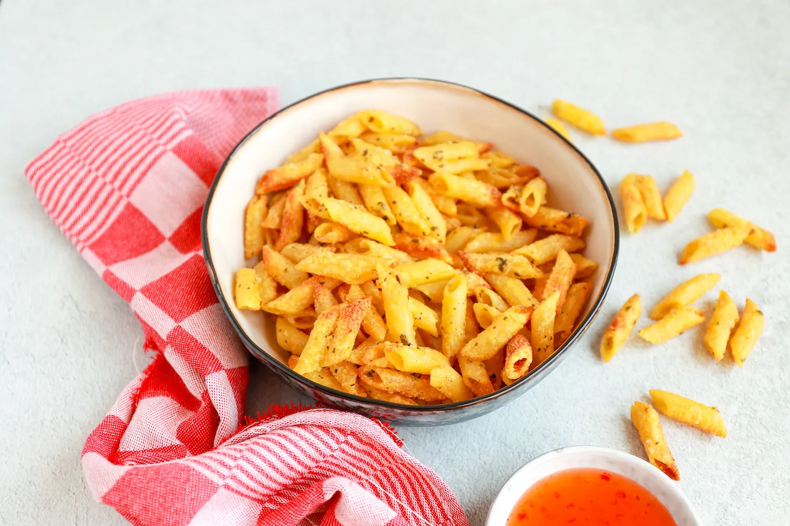

# Forca Ajax

## we gaan winnen

# Pasta chips

## BENODIGDHEDEN

200 gr pasta
bijv penne
3 el olijfolie
Parmezaanse kaas
2 tl oregano
zout en peper

### BEREIDING
Kook de pasta volgens de instructies op het pak. Giet de pasta af, spoel even af met water en voeg vervolgens de olijfolie, Parmezaanse kaas, oregano en een snufje zout en peper toe. Meng alles door elkaar. Bak de pasta 10 minuten op 200 graden in de Airfryer. Schud ze halverwege een keer door elkaar.

https://www.lekkerensimpel.com/pasta-chips/

